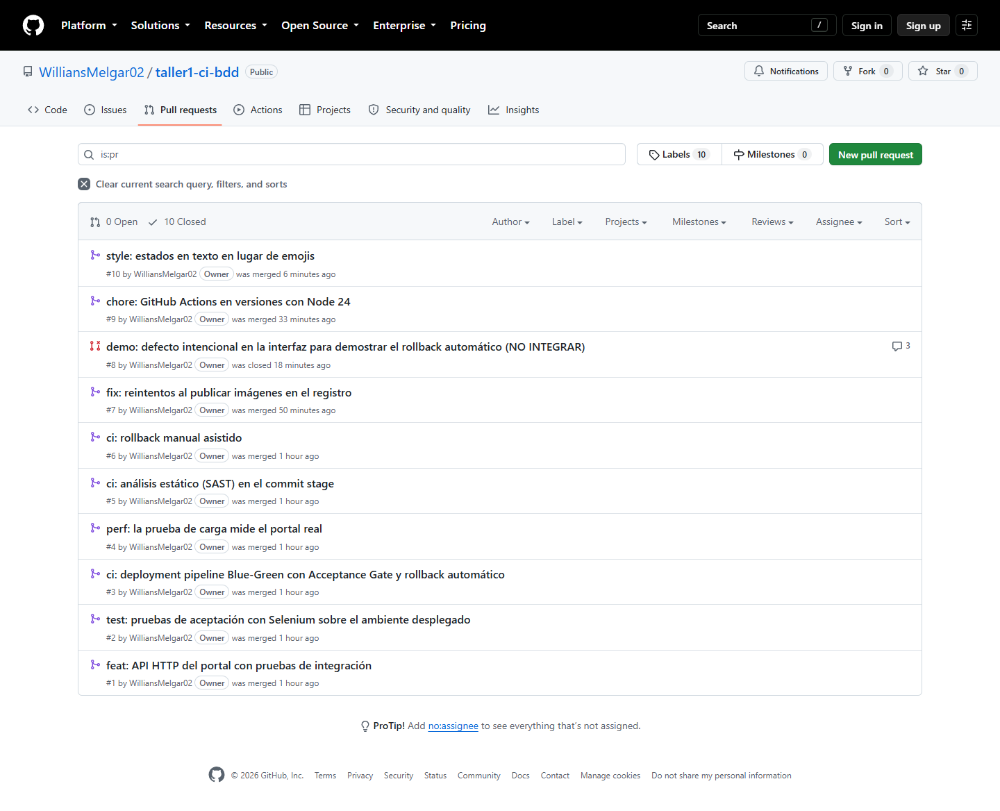
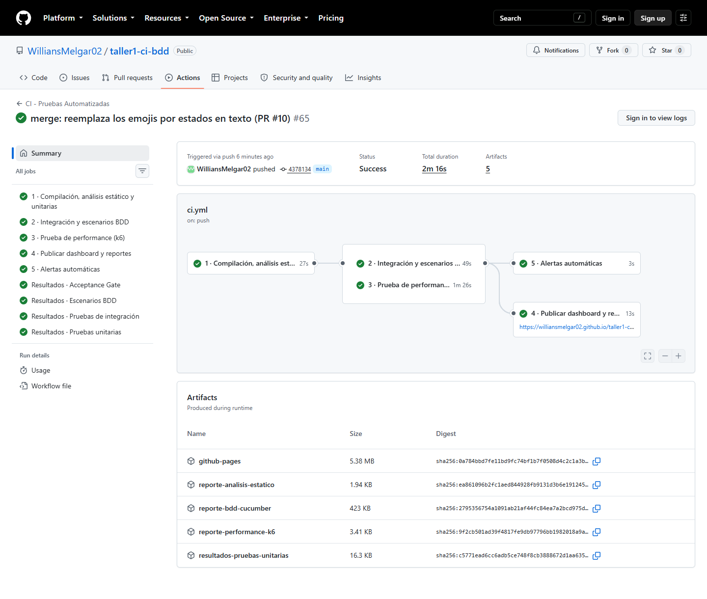
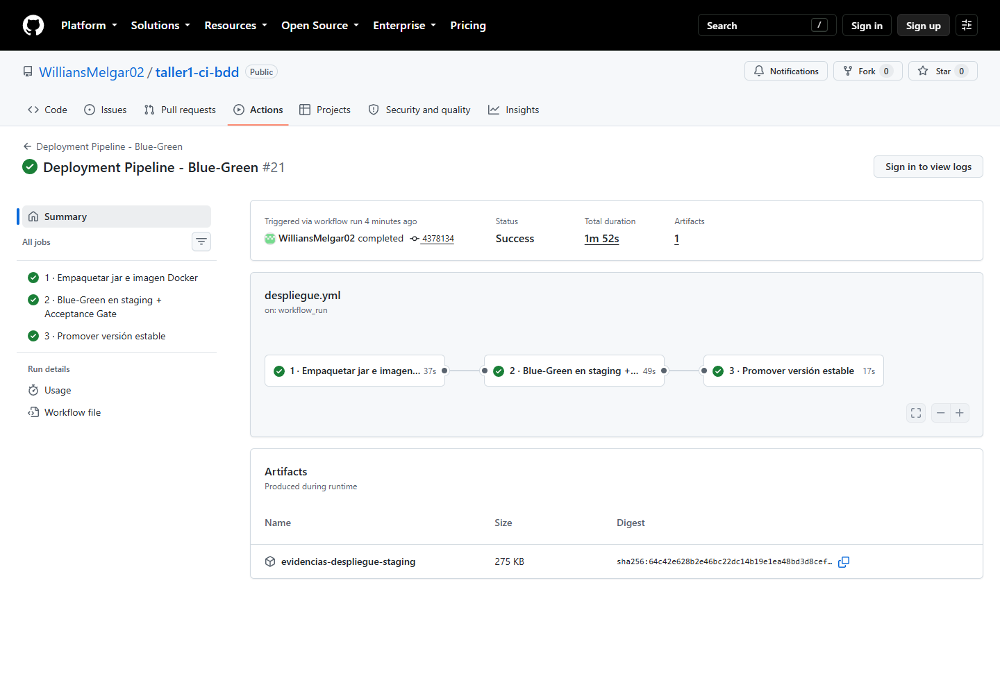
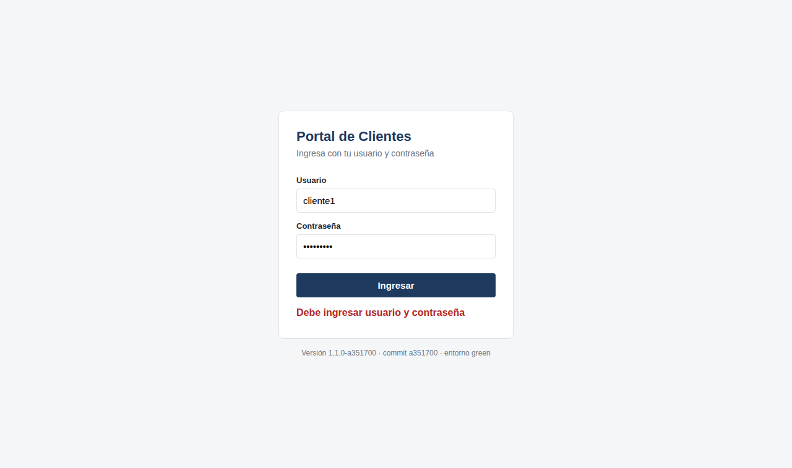

# Portal de Clientes · Integración continua y deployment pipeline

[](https://github.com/WilliansMelgar02/taller1-ci-bdd/actions/workflows/ci.yml)
[](https://github.com/WilliansMelgar02/taller1-ci-bdd/actions/workflows/despliegue.yml)

**Autor:** Willians Eduardo Melgar Cherres
**Asignatura:** Automatización de Pruebas · Examen Final (Unidades I, II y III)
**Repositorio:** <https://github.com/WilliansMelgar02/taller1-ci-bdd>
**Dashboard de calidad:** <https://williansmelgar02.github.io/taller1-ci-bdd/>

---

## Índice

1. [Descripción del proyecto](#1-descripción-del-proyecto)
2. [Cómo se cumple cada actividad](#2-cómo-se-cumple-cada-actividad)
3. [Stack tecnológico](#3-stack-tecnológico)
4. [Estructura del proyecto](#4-estructura-del-proyecto)
5. [Actividad 1: repositorio Git y proyecto Maven](#5-actividad-1-repositorio-git-y-proyecto-maven)
6. [Estrategia de pruebas](#6-estrategia-de-pruebas)
7. [Actividad 2: pipeline de integración continua](#7-actividad-2-pipeline-de-integración-continua)
8. [Actividad 3: deployment pipeline con Blue-Green y rollback](#8-actividad-3-deployment-pipeline-con-blue-green-y-rollback)
9. [Cómo ejecutar las pruebas y los pipelines](#9-cómo-ejecutar-las-pruebas-y-los-pipelines)
10. [Resultados obtenidos](#10-resultados-obtenidos)
11. [Evidencias](#11-evidencias)
12. [Relación con el material del curso](#12-relación-con-el-material-del-curso)

---

## 1. Descripción del proyecto

El **Portal de Clientes** es una aplicación Java con una API HTTP de inicio de
sesión y una interfaz web. Sobre ella se construyó un proceso completo de
calidad y entrega:

- un **pipeline de integración continua** que compila, analiza el código y
  ejecuta pruebas unitarias, de integración, BDD y de performance en cada push y
  cada Pull Request;
- un **deployment pipeline** que empaqueta la aplicación como imagen Docker, la
  despliega en un ambiente de pruebas con la estrategia **Blue-Green**, ejecuta
  **pruebas de aceptación con Selenium** contra la versión desplegada y, si algo
  falla, hace **rollback automático** a la versión estable.

### Reglas de negocio del login

Acordadas en la sesión Three Amigos ([`docs/01-sesion-three-amigos.md`](docs/01-sesion-three-amigos.md)):

| Regla | Comportamiento | Respuesta de la API |
|---|---|---|
| RN-01 | Acceso solo con usuario y contraseña coincidentes | `200` |
| RN-02 | La contraseña distingue mayúsculas de minúsculas | `401` |
| RN-03 | Mensaje de error genérico, sin revelar qué dato falló | `401` |
| RN-04 | La cuenta se bloquea tras 3 intentos fallidos consecutivos | `423` |
| RN-05 | Un ingreso exitoso reinicia el contador de intentos | `200` |
| RN-06 | Con campos vacíos se piden los datos y no se descuenta intento | `400` |

### Endpoints

| Ruta | Método | Descripción |
|---|---|---|
| `/` | GET | Interfaz web del portal |
| `/api/login` | POST | Autenticación: `{"usuario": "...", "contrasena": "..."}` |
| `/health` | GET | Estado, versión, commit y color Blue-Green del despliegue |

---

## 2. Cómo se cumple cada actividad

| Actividad | Requisito del enunciado | Dónde está | Evidencia |
|---|---|---|---|
| **1** | Repositorio Git con flujo de ramas definido | Trunk-Based Development: [`docs/04-estrategia-de-ramas.md`](docs/04-estrategia-de-ramas.md) | [Figs. 20 y 21](#11-evidencias) |
| **1** | Proyecto Maven con dependencias de pruebas | [`pom.xml`](pom.xml): JUnit 5, Cucumber, Selenium, JaCoCo, SpotBugs | [Fig. 22](#11-evidencias) |
| **2** | Pipeline de CI con stages de build y pruebas | [`.github/workflows/ci.yml`](.github/workflows/ci.yml) y [`Jenkinsfile`](Jenkinsfile) | [Figs. 23, 33 y 34](#11-evidencias) |
| **2** | Al menos pruebas unitarias y de integración | 44 unitarias (Surefire) y 11 de integración sobre el servidor HTTP real (Failsafe), más 8 escenarios BDD | [Fig. 34](#11-evidencias) |
| **3** | Deployment pipeline con acceptance tests y despliegue en ambiente de prueba | [`.github/workflows/despliegue.yml`](.github/workflows/despliegue.yml), [`Dockerfile`](Dockerfile), [`infra/`](infra/) | [Figs. 24 y 30](#11-evidencias) |
| **3** | Rollback o despliegue Canary/Blue-Green | Blue-Green **y** rollback automático y manual: [`docs/05-pipeline-de-despliegue.md`](docs/05-pipeline-de-despliegue.md) | [Figs. 25 a 27, 31 y 32](#11-evidencias) |
| Documentación | README con estrategia, ejecución y capturas | Este archivo | [Sección 11](#11-evidencias) |

---

## 3. Stack tecnológico

| Herramienta | Versión | Rol |
|---|---|---|
| Java (Temurin) | 17 LTS | Lenguaje y plataforma |
| Maven | 3.9.9 | Build, dependencias y ciclo de vida de pruebas |
| JUnit 5 | 5.11.4 | Pruebas unitarias y de integración |
| Cucumber | 7.20.1 | Escenarios BDD y pruebas de aceptación en Gherkin |
| Selenium WebDriver | 4.49.0 | Pruebas de aceptación sobre la interfaz web |
| Gson | 2.14.0 | Contrato JSON de la API |
| JaCoCo | 0.8.12 | Cobertura con umbral que rompe el build |
| SpotBugs + Find Security Bugs | 4.10.4 / 1.14.0 | Análisis estático (SAST) |
| k6 | 0.55 (local) · 2.2 (CI) | Prueba de carga con umbrales de SLA |
| Docker | `eclipse-temurin:17-jre-alpine` | Imagen de ejecución |
| NGINX | 1.27 | Proxy del cambio de tráfico Blue-Green |
| GitHub Actions | — | CI y deployment pipeline |
| GitHub Container Registry | — | Registro de imágenes versionadas |
| Jenkins (declarativo) | — | Pipeline equivalente on-premise |

La API usa el servidor HTTP incluido en el JDK, no un framework: la aplicación
expone tres rutas, arranca en milisegundos (lo que acorta el health check del
despliegue) y la imagen queda liviana.

---

## 4. Estructura del proyecto

```
taller1-ci-bdd/
├── .github/workflows/
│   ├── ci.yml                        Pipeline de integración continua (Actividad 2)
│   ├── despliegue.yml                Deployment pipeline Blue-Green (Actividad 3)
│   └── rollback-manual.yml           Rollback manual asistido (Actividad 3)
├── infra/                            Scripts de despliegue, compartidos por Actions y Jenkins
│   ├── comun.sh                      Configuración del ambiente y funciones comunes
│   ├── preparar-ambiente.sh          Red Docker y proxy NGINX
│   ├── desplegar-estable.sh          Versión estable en BLUE
│   ├── desplegar-candidata.sh        Versión candidata en GREEN
│   ├── verificar-salud.sh            Health check con verificación de versión
│   ├── cambiar-trafico.sh            Switch Blue-Green
│   ├── rollback.sh                   Rollback automático verificado
│   ├── publicar-imagen.sh            Publicación con reintentos
│   ├── estado-ambiente.sh            Resumen del despliegue
│   └── destruir-ambiente.sh          Limpieza del ambiente efímero
├── src/main/java/cl/taller/qa/
│   ├── Aplicacion.java               Punto de entrada (java -jar)
│   ├── ServicioAutenticacion.java    Reglas de negocio RN-01 a RN-06
│   ├── ResultadoAutenticacion.java   Resultado inmutable del login
│   ├── EstadoAutenticacion.java      Desenlaces posibles del login
│   ├── Calculadora.java              Servicio aritmético (Taller 1)
│   └── web/                          API HTTP e interfaz web
├── src/main/resources/web/           index.html, app.js, estilos.css
├── src/test/java/cl/taller/qa/
│   ├── Calculadora*Test.java         Unitarias (Taller 1)
│   ├── web/*Test.java                Unitarias de configuración y API
│   ├── integracion/ApiPortalIT.java  Integración: servidor HTTP real
│   ├── bdd/                          Escenarios BDD sobre el dominio
│   └── aceptacion/                   Aceptación: Selenium + API contra staging
├── src/test/resources/
│   ├── features/login.feature        Especificación BDD de negocio
│   └── aceptacion/*.feature          Escenarios críticos del Acceptance Gate
├── performance/login-carga.js        Prueba de carga k6
├── reportes/index.html               Dashboard de calidad (GitHub Pages)
├── docs/                             Documentación y evidencias
├── Dockerfile · .dockerignore        Imagen de ejecución
├── Jenkinsfile                       Pipeline equivalente on-premise
└── pom.xml                           Dependencias, plugins y perfiles
```

---

## 5. Actividad 1: repositorio Git y proyecto Maven

### 5.1 Flujo de ramas: Trunk-Based Development

Detalle completo en [`docs/04-estrategia-de-ramas.md`](docs/04-estrategia-de-ramas.md).

Se eligió Trunk-Based y no GitFlow siguiendo el criterio del curso: GitFlow "es
útil en equipos grandes donde hay ciclos largos y versiones estables
planificadas", mientras que Trunk-Based es "ideal para equipos ágiles y
despliegues continuos" (ME_1, p. 8). Este proyecto se desarrolla de forma
individual y **cada merge a `main` se despliega y se promueve**.

| Regla | Aplicación |
|---|---|
| `main` siempre desplegable | Todo merge pasa por CI y deployment pipeline |
| Ramas de vida corta | De 1 a 4 commits: `feature/`, `fix/`, `chore/`, `style/`, `docs/`, `demo/` |
| Integración solo por Pull Request | Con CI y Acceptance Gate en verde |
| Merge commit por entrega | `merge: integra ... (PR #n)` |
| Conventional Commits | `tipo(alcance): resumen` y cuerpo con el porqué |
| Versionado | SemVer en el `pom.xml`, imagen por commit y release `v1.1.0` |

### 5.2 Proyecto Maven

| Elemento del `pom.xml` | Para qué sirve |
|---|---|
| BOM de JUnit y Cucumber | Versiones coherentes de cada familia de artefactos |
| `maven-surefire-plugin` | Pruebas unitarias (`*Test.java`) en `mvn test` |
| `maven-failsafe-plugin` | Integración y BDD (`*IT.java`) en `mvn verify`; excluye la suite de aceptación |
| `jacoco-maven-plugin` | Cobertura combinada con umbral: 80 % de instrucciones, 70 % de ramas y 70 % por clase |
| `spotbugs-maven-plugin` + Find Security Bugs | Análisis estático; un hallazgo medio o alto rompe el build |
| `maven-jar-plugin` + `maven-shade-plugin` | Jar ejecutable autocontenido (`target/portal-clientes.jar`) con la versión en el MANIFEST |
| Perfil `aceptacion` | Ejecuta solo las pruebas de aceptación contra una URL (`-Durl.base`) |

---

## 6. Estrategia de pruebas

Las pruebas se organizan en niveles, de las más rápidas y numerosas a las más
lentas y cercanas al usuario, siguiendo el "pipeline escalonado (unit →
integration → functional → performance)" del curso (ME_4, p. 14). Cada nivel
detecta un tipo de defecto que el anterior no puede ver.

```
                    ┌─────────────────────────┐
                    │ Aceptación en staging   │  8   Selenium + API contra el contenedor desplegado
                    ├─────────────────────────┤
                    │ Performance (k6)        │  356 peticiones con umbrales de SLA
                ┌───┴─────────────────────────┴───┐
                │ Escenarios BDD (Cucumber)       │  8   Reglas de negocio en Gherkin
            ┌───┴─────────────────────────────────┴───┐
            │ Integración (servidor HTTP real)        │  11  API + JSON + servicio juntos
        ┌───┴─────────────────────────────────────────┴───┐
        │ Unitarias (JUnit 5)                             │  44  Lógica aislada, milisegundos
    ┌───┴─────────────────────────────────────────────────┴───┐
    │ Análisis estático (SpotBugs + Find Security Bugs)       │  Sin ejecutar el código
    └─────────────────────────────────────────────────────────┘
```

| Nivel | Herramienta | Qué valida | Cuándo corre | Cantidad |
|---|---|---|---|---|
| Análisis estático | SpotBugs + Find Security Bugs | Defectos probables y vulnerabilidades (inyección, XSS, nulos) | Cada push y PR, antes de las pruebas | 15 clases, 0 hallazgos |
| Unitarias | JUnit 5 · Surefire | Lógica aislada: calculadora, configuración, códigos HTTP | Cada push y PR | 44 |
| Integración | JUnit 5 + HttpClient · Failsafe | Servidor HTTP real en puerto libre: rutas, JSON, códigos, cabeceras | Cada push y PR | 11 |
| BDD | Cucumber · Failsafe | Reglas RN-01 a RN-06 escritas en lenguaje de negocio | Cada push y PR | 8 |
| Performance | k6 | SLA del login sobre el jar real: p95 < 800 ms, error < 1 %, > 5 TPS | Cada push y PR | 356 peticiones |
| Aceptación | Cucumber + Selenium + HttpClient | Escenarios críticos de punta a punta sobre la imagen desplegada en GREEN | Deployment pipeline | 8 |

**Principios aplicados**

- **Atomicidad e independencia.** Cada prueba unitaria crea sus objetos, cada
  prueba de integración levanta su propio servidor en un puerto libre y
  Cucumber crea una instancia nueva de pasos por escenario.
- **Idempotencia.** Las pruebas de aceptación corren contra un ambiente
  compartido. Usan usuarios inventados en cada ejecución, así que repetir la
  suite no bloquea cuentas (ME_3, p. 5: "pueden repetirse sin efectos
  secundarios").
- **Page Object y esperas explícitas.** Los pasos de Selenium no conocen
  selectores y nunca usan pausas fijas.
- **Verificación de versión.** El Acceptance Gate falla si responde una versión
  distinta de la que se desplegó.
- **Evidencia automática.** Si un escenario web falla, Selenium adjunta una
  captura de pantalla al reporte.
- **Cobertura como red de seguridad.** JaCoCo combina unitarias, integración y
  BDD, y exige un mínimo por clase para que un promedio alto no esconda una
  clase sin probar.

---

## 7. Actividad 2: pipeline de integración continua

Archivo: [`.github/workflows/ci.yml`](.github/workflows/ci.yml). Se dispara en
cada push a `main`, `feature/**` y `fix/**`, en cada Pull Request hacia `main` y
manualmente.

```
 push / pull_request
        │
        ▼
 ┌────────────────────────────────────────┐
 │ 1 · Compilación, análisis estático     │  mvn compile → spotbugs:check → mvn test
 │     y unitarias                        │
 └───────────────────┬────────────────────┘
          ┌──────────┴──────────┐           corren en paralelo
          ▼                     ▼
 ┌─────────────────────┐ ┌─────────────────────┐
 │ 2 · Integración y   │ │ 3 · Performance k6  │
 │     escenarios BDD  │ │     sobre el jar    │
 │     + cobertura     │ │     real            │
 └──────────┬──────────┘ └──────────┬──────────┘
            └──────────┬────────────┘
          ┌────────────┴────────────┐
          ▼                         ▼
 ┌─────────────────────┐ ┌─────────────────────┐
 │ 4 · Dashboard en    │ │ 5 · Alertas         │
 │     GitHub Pages    │ │     automáticas     │
 └─────────────────────┘ └─────────────────────┘
          │
          └──► si todo terminó en verde sobre main: deployment pipeline
```

| Decisión | Justificación |
|---|---|
| Etapas ordenadas por costo | *Fail fast*: un error de compilación o unitario se detecta en segundos |
| Análisis estático antes de las pruebas | "Después de Build y antes de Unit Tests" (ME_6, p. 12) |
| Integración y performance en paralelo | No dependen entre sí; serializarlas solo alargaría el pipeline |
| k6 sobre el jar real | El SLA se mide sobre el artefacto que se entrega, no sobre una simulación |
| Resultados como checks del PR y resumen del run | Las métricas se ven sin descargar artefactos |
| `concurrency` con cancelación | Un push nuevo cancela el run obsoleto de la misma rama |
| `Jenkinsfile` equivalente | Mismas etapas en Jenkins: la estrategia no depende de la herramienta |

Detalle del dashboard y las alertas en
[`docs/02-dashboard-metricas.md`](docs/02-dashboard-metricas.md) y
[`docs/03-alertas-automaticas.md`](docs/03-alertas-automaticas.md).

---

## 8. Actividad 3: deployment pipeline con Blue-Green y rollback

Archivo: [`.github/workflows/despliegue.yml`](.github/workflows/despliegue.yml).
Diseño completo, justificación y evidencias en
[`docs/05-pipeline-de-despliegue.md`](docs/05-pipeline-de-despliegue.md).

```
 CI en verde sobre main  (o Pull Request, sin promoción)
        │
        ▼
 1 · Empaquetar ── jar + imagen Docker portal-clientes:1.1.0-<commit> → GHCR
        │
        ▼
 2 · Staging efímero Blue-Green
        estable   → BLUE  (:8081)  con tráfico
        candidata → GREEN (:8082)  sin tráfico → health check de versión
        Acceptance Gate (Selenium + API) contra GREEN
        cambio de tráfico del proxy NGINX a GREEN → smoke test
        si algo falla → infra/rollback.sh: el tráfico vuelve a BLUE
        │
        ▼
 3 · Promover (solo main) ── etiqueta 'estable' + release v1.1.0
```

**Por qué Blue-Green.** El portal es un servicio de una sola instancia y el
ambiente de pruebas no tiene usuarios reales. Con Blue-Green la versión nueva se
valida completa **antes** de recibir tráfico y el rollback es inmediato. Un
Canary necesitaría tráfico real para medir algo y un router con pesos (ME_6,
pp. 8-11).

**Rollback en dos modalidades**

| Tipo | Cuándo | Cómo |
|---|---|---|
| Automático | Falla el health check, el Acceptance Gate o el smoke test | Paso con `if: failure()`, equivalente al `post { failure }` de Jenkins (ME_6, p. 6); verifica que el proxy responde la versión estable |
| Manual asistido | Se detecta un defecto después de promover | Workflow `rollback-manual.yml`: se elige versión y motivo; se valida con sus propias pruebas de aceptación antes de devolverle el tráfico |

### Demostración del rollback automático

El [PR #8](https://github.com/WilliansMelgar02/taller1-ci-bdd/pull/8)
introduce un defecto realista **a propósito**: la interfaz envía el campo
`clave` en lugar de `contrasena`. Se cerró sin integrar.

| Etapa | Resultado | Por qué |
|---|---|---|
| CI: análisis estático, unitarias, integración, BDD y performance | Verde | Ninguna de esas pruebas ejecuta el JavaScript del navegador |
| Empaquetar | Verde | La imagen se construye |
| Health check de GREEN | Verde | El servidor arranca y responde la versión correcta |
| **Acceptance Gate** | **Rojo: 2 de 8 escenarios fallan** | Selenium detecta que ningún cliente puede ingresar |
| **Rollback automático** | **Ejecutado** | El tráfico nunca salió de BLUE (`1.1.0-81ff638`); GREEN se descartó |
| Promoción | Omitida | La versión defectuosa nunca llegó a ser estable |

---

## 9. Cómo ejecutar las pruebas y los pipelines

### Requisitos

- JDK 17 y Maven 3.9 o superior.
- Google Chrome (pruebas de aceptación).
- k6 (prueba de carga).
- Docker (solo para reproducir el despliegue fuera del pipeline).

En Windows, `preparar-entorno.ps1` agrega Maven y k6 al PATH de la sesión y
deja la consola en UTF-8:

```powershell
Set-ExecutionPolicy -Scope Process Bypass -Force
. .\preparar-entorno.ps1
```

### Pruebas en local

```bash
mvn clean test                       # 44 pruebas unitarias
mvn clean verify                     # unitarias + 11 de integración + 8 BDD + umbral de cobertura
mvn compile spotbugs:check           # análisis estático
mvn site -DskipTests                 # reportes HTML de Surefire y Failsafe en target/site
```

### Aplicación y pruebas de aceptación en local

```bash
mvn package -DskipTests
java -jar target/portal-clientes.jar            # portal en http://localhost:8080

# en otra terminal, con el portal en ejecución:
mvn verify -Paceptacion -Durl.base=http://localhost:8080 -Dversion.esperada=1.1.0
mvn verify -Paceptacion -Dnavegador.visible=true   # para ver el navegador
```

Usuarios de demostración: `wmelgar / Segura2026!`, `cliente1 / Clave123!` y
`cliente2 / Clave123!`.

### Prueba de carga

```powershell
.\correr-performance.ps1             # empaqueta, levanta el portal, ejecuta k6 y lo detiene
```

### Imagen Docker

```bash
mvn package -DskipTests
docker build --build-arg VERSION=1.1.0-local -t portal-clientes:1.1.0-local .
docker run -p 8080:8080 -e COLOR_DESPLIEGUE=blue portal-clientes:1.1.0-local
```

### Pipelines

| Pipeline | Cómo se ejecuta |
|---|---|
| CI | Automático en cada push y Pull Request; manual en *Actions → CI - Pruebas Automatizadas → Run workflow* |
| Deployment pipeline | Automático cuando el CI de `main` termina en verde y en cada Pull Request; manual en *Actions → Deployment Pipeline - Blue-Green* |
| Rollback manual | *Actions → Rollback manual asistido → Run workflow*, indicando la versión (por ejemplo `1.1.0-4c77e2c`) y el motivo |
| Jenkins | Job *Multibranch Pipeline* apuntando a este repositorio. Requisitos en la cabecera del `Jenkinsfile`: agente con Docker y Chrome, y credencial `ghcr` |

---

## 10. Resultados obtenidos

Ejecución del pipeline de `main` del 16-09-2026 (CI build #65 y su deployment
pipeline).

| Suite | Ejecutadas | Fallos | Etapa |
|---|---|---|---|
| Análisis estático | 15 clases | 0 hallazgos | CI · 1 |
| Pruebas unitarias | 44 | 0 | CI · 1 |
| Pruebas de integración | 11 | 0 | CI · 2 |
| Escenarios BDD | 8 | 0 | CI · 2 |
| Pruebas de aceptación en staging | 8 | 0 | Deployment · 2 |

| Cobertura (JaCoCo) | Valor | Umbral |
|---|---|---|
| Instrucciones | 88,8 % | > 80 % |
| Ramas | 87,1 % | > 70 % |
| Clase con menor cobertura sujeta a umbral | 71,4 % | > 70 % |

| Performance (k6, 10 usuarios virtuales, 55 s) | Valor | Umbral |
|---|---|---|
| Peticiones | 356 | — |
| Throughput | 6,47 TPS | > 5 |
| Latencia promedio | 0,92 ms | < 400 ms |
| Latencia p95 | 1,37 ms | < 800 ms |
| Latencia p99 | 2,30 ms | < 1500 ms |
| Tasa de error | 0,00 % | < 1 % |

| Despliegue | Resultado |
|---|---|
| Deployment pipeline de `main` | Verde: versión `1.1.0-4378134` promovida como estable |
| Rollback automático (PR #8) | Ejecutado y verificado: tráfico restaurado en la versión estable |
| Rollback manual a `1.1.0-4c77e2c` | Versión restaurada, validada con sus pruebas de aceptación y marcada como estable |
| Release | [`v1.1.0`](https://github.com/WilliansMelgar02/taller1-ci-bdd/releases/tag/v1.1.0) |

---

## 11. Evidencias

Todas las evidencias corresponden a ejecuciones reales. El índice navegable
está en [`docs/evidencias/index.html`](docs/evidencias/index.html), también
publicado en el dashboard.

### Actividad 1

| Fig. | Archivo | Qué demuestra |
|---|---|---|
| 20 | [`20-pull-requests-integrados.png`](docs/evidencias/20-pull-requests-integrados.png) | PRs #1 a #10 integrados y el #8 cerrado sin integrar |
| 21 | [`21-historial-main.png`](docs/evidencias/21-historial-main.png) | Un merge commit por PR en `main` |
| 22 | [`22-pom-dependencias.png`](docs/evidencias/22-pom-dependencias.png) | Dependencias de prueba del `pom.xml` |



### Actividad 2

| Fig. | Archivo | Qué demuestra |
|---|---|---|
| 23 | [`23-ci-pipeline-main.png`](docs/evidencias/23-ci-pipeline-main.png) | Las cinco etapas del CI en verde sobre `main` |
| 33 | [`33-reporte-analisis-estatico.png`](docs/evidencias/33-reporte-analisis-estatico.png) | SpotBugs: 15 clases, 0 advertencias |
| 34 | [`34-reporte-integracion-failsafe.png`](docs/evidencias/34-reporte-integracion-failsafe.png) | 19 pruebas de Failsafe (11 de integración y 8 BDD) al 100 % |
| 35 | [`35-dashboard-calidad.png`](docs/evidencias/35-dashboard-calidad.png) | Dashboard con los indicadores del build #65 |



### Actividad 3

| Fig. | Archivo | Qué demuestra |
|---|---|---|
| 24 | [`24-despliegue-blue-green-main.png`](docs/evidencias/24-despliegue-blue-green-main.png) | Deployment pipeline de `main` en verde |
| 25 | [`25-rollback-automatico-run.png`](docs/evidencias/25-rollback-automatico-run.png) | Acceptance Gate en rojo y promoción omitida con el defecto |
| 26 | [`26-pr-demo-rollback.png`](docs/evidencias/26-pr-demo-rollback.png) | PR #8: defecto intencional y despliegue fallido en staging |
| 27 | [`27-rollback-manual-run.png`](docs/evidencias/27-rollback-manual-run.png) | Rollback manual asistido exitoso |
| 28 | [`28-release-v1-1-0.png`](docs/evidencias/28-release-v1-1-0.png) | Release creada por la etapa de promoción |
| 30 | [`30-reporte-aceptacion-verde.png`](docs/evidencias/30-reporte-aceptacion-verde.png) | Acceptance Gate en `main`: 8 escenarios aprobados |
| 31 | [`31-reporte-aceptacion-rollback.png`](docs/evidencias/31-reporte-aceptacion-rollback.png) | Acceptance Gate con el defecto: 2 escenarios fallidos |
| 32 | [`32-selenium-captura-del-fallo.png`](docs/evidencias/32-selenium-captura-del-fallo.png) | Captura tomada por Selenium en GREEN al fallar |
| 36 | [`36-portal-web-local.png`](docs/evidencias/36-portal-web-local.png) | Portal ejecutándose en local con ingreso exitoso |





### Logs y auditoría

GitHub solo muestra los logs a usuarios con sesión iniciada. Por eso se
descargaron completos desde las ejecuciones reales:

| Archivo | Contenido |
|---|---|
| [`logs/ci-1-commit-stage.log`](docs/evidencias/logs/ci-1-commit-stage.log) | Compilación, SpotBugs y 44 pruebas unitarias |
| [`logs/ci-2-integracion-bdd.log`](docs/evidencias/logs/ci-2-integracion-bdd.log) | 19 pruebas de Failsafe y verificación de cobertura |
| [`logs/ci-3-performance-k6.log`](docs/evidencias/logs/ci-3-performance-k6.log) | Prueba de carga sobre el portal real |
| [`logs/despliegue-blue-green-main.log`](docs/evidencias/logs/despliegue-blue-green-main.log) | BLUE, GREEN, Acceptance Gate, switch y smoke test |
| [`logs/rollback-automatico-pr8.log`](docs/evidencias/logs/rollback-automatico-pr8.log) | Defecto detectado y rollback verificado |
| [`logs/rollback-manual.log`](docs/evidencias/logs/rollback-manual.log) | Restauración de la versión `1.1.0-4c77e2c` |
| [`auditoria/`](docs/evidencias/auditoria/) | Metadatos de cada despliegue y logs de la candidata descartada |

Las evidencias `01` a `16` corresponden al Taller 1 (Unidad II) y se conservan
como historial del proyecto.

---

## 12. Relación con el material del curso

| Material | Concepto | Aplicación en el proyecto |
|---|---|---|
| ME_1 (Unidad I) | GitFlow vs Trunk-Based; Maven y `pom.xml` | Trunk-Based justificado por su criterio; Maven con Surefire, Failsafe y perfiles |
| ME_2 (Unidad I) | Configuración de ambientes; staging idéntico a producción | Staging con la misma imagen que se promueve; configuración solo por variables de entorno |
| ME_3 (Unidad II) | Etapas Compile, Unit, Integration, Acceptance; idempotencia | Mismo orden de etapas; pruebas de aceptación idempotentes |
| ME_4 (Unidad II) | BDD con Gherkin; pipeline escalonado; Page Objects | Escenarios en español, niveles de prueba escalonados y Page Object con Selenium |
| ME_5 (Unidad III) | Deployment pipeline; commit stage; Acceptance Gate; entornos efímeros; versiones previas de artefactos | Pipeline de tres etapas, ambiente efímero en Docker e imágenes inmutables por commit |
| ME_6 (Unidad III) | Rollback con `post.failure`; Blue-Green; SAST; auditoría | Rollback automático y manual, Blue-Green con NGINX, SpotBugs y metadatos de despliegue |

### Documentación complementaria

| Documento | Contenido |
|---|---|
| [`docs/01-sesion-three-amigos.md`](docs/01-sesion-three-amigos.md) | Sesión Three Amigos y reglas de negocio |
| [`docs/02-dashboard-metricas.md`](docs/02-dashboard-metricas.md) | Métricas y dashboard |
| [`docs/03-alertas-automaticas.md`](docs/03-alertas-automaticas.md) | Matriz de alertas |
| [`docs/04-estrategia-de-ramas.md`](docs/04-estrategia-de-ramas.md) | Trunk-Based Development y protección de `main` |
| [`docs/05-pipeline-de-despliegue.md`](docs/05-pipeline-de-despliegue.md) | Deployment pipeline, Blue-Green y rollback |
